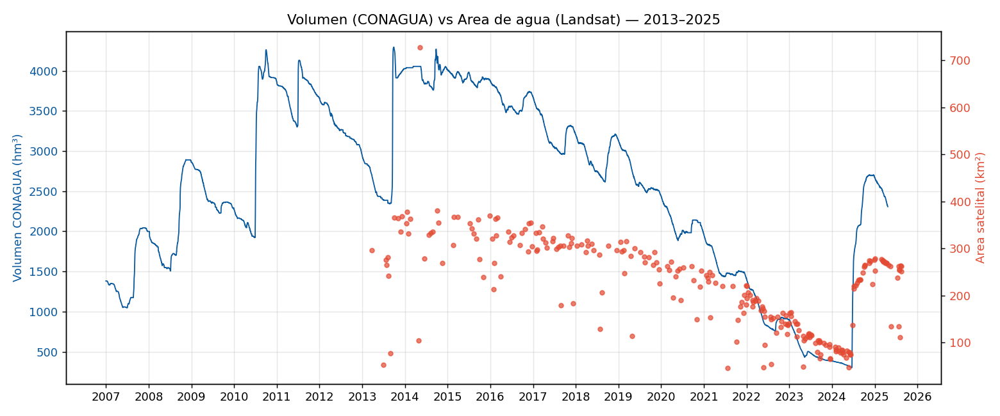
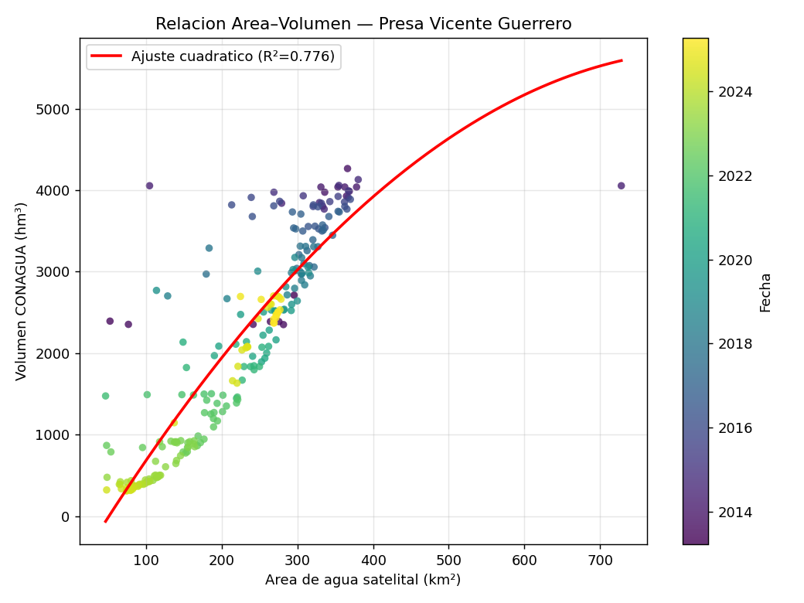

# Estimación del volumen de la presa Vicente Guerrero (Las Adjuntas) con Landsat y CONAGUA

Proyecto de ciencia de datos para **estimar el volumen almacenado** en la presa
Vicente Guerrero —conocida como **Las Adjuntas**, en Padilla, Tamaulipas— a partir
de **imágenes satelitales Landsat**, validarlo contra los **registros oficiales de
CONAGUA**, y **predecir** el comportamiento futuro del embalse.

---

## ¿Por qué estimar el volumen con satélite si CONAGUA ya lo mide?

- **Detección de azolvamiento:** el sedimento reduce la capacidad real de la presa
  con los años; comparar el área satelital histórica contra el volumen registrado
  permite detectar esa pérdida, algo que la escala de la cortina no revela.
- **Verificación independiente** de los registros oficiales.
- **Transferibilidad:** la técnica sirve para miles de cuerpos de agua sin
  instrumentación.
- **Datos abiertos y reproducibles** (Landsat + CONAGUA, ambos gratuitos).

> El satélite **no mide volumen**: mide el **área superficial** del agua. El proyecto
> convierte esa área 2D en volumen 3D usando la relación empírica área–volumen
> calibrada con los datos de CONAGUA.

---

## Estado del proyecto

| Fase | Descripción | Estado |
|------|-------------|:------:|
| 0 | Factibilidad de datos (fuentes CONAGUA y Landsat) | ✅ |
| 1 | Serie de **volumen** (CONAGUA, diaria 2007–2025) | ✅ |
| 1 | Serie de **área** de agua (Landsat, 2013–2025) | ✅ |
| 2 | Relación **área → volumen** (validación) | 🟡 en curso |
| 3 | Modelo **predictivo** del volumen | ⏳ pendiente |

---

## Resultados hasta ahora

**La relación área–volumen se valida:** el área derivada de Landsat sigue de cerca el
volumen oficial de CONAGUA a lo largo de 12 años (correlación **r ≈ 0.89, R² ≈ 0.80**).



*Serie de volumen (CONAGUA, azul) y área de agua satelital (Landsat, rojo). Ambas
suben y bajan juntas, incluida la sequía histórica de 2024 y la recuperación de 2025.*



*Dispersión área–volumen coloreada por año. La relación es fuerte y creciente. El
gradiente de color sugiere una posible señal de azolvamiento (misma área → menos
volumen con los años), aún por confirmar tras descartar el efecto de saturación del
área cerca del nivel lleno.*

### Datos de la presa

| Campo | Valor |
|-------|-------|
| Nombre oficial | Vicente Guerrero, Tamps. |
| Nombre común | Las Adjuntas |
| Clave SIH (CONAGUA) | `VGRTP` |
| Ubicación | Padilla, Tamaulipas (23.9594, −98.6664) |
| Capacidad NAMO | 3,910.69 hm³ |
| Rango de llenado 2007–2025 | 7.7 % (sequía 2024) – 109.8 % |

---

## Estructura del repositorio

```
LasAdjuntas/
├── README.md
├── Protocolo_Las_Adjuntas.docx        # Protocolo de investigación (documento formal)
├── data/
│   ├── conagua_las_adjuntas.csv        # Volumen diario CONAGUA 2007–2025 (verdad de campo)
│   ├── area_agua_las_adjuntas.csv      # Área de agua satelital (Landsat, crudo)
│   ├── serie_area_limpia.csv           # Área depurada (1 valor por fecha)
│   ├── cruce_area_volumen.csv          # Fechas con área y volumen emparejados
│   └── *.png                           # Figuras
└── scripts/
    ├── 01_descargar_conagua.py         # Descarga CONAGUA (versión completa, con elevación)
    ├── 01_descargar_conagua_rapido.py  # Descarga CONAGUA (versión rápida, recomendada)
    ├── 02_area_agua_gee.js             # Google Earth Engine: área de agua con MNDWI
    └── 03_cruce_area_volumen.py        # Cruce y validación área ↔ volumen
```

---

## Fuentes de datos

- **Volumen (CONAGUA):** Sistema Nacional de Información del Agua (SINA), módulo de
  Monitoreo de Presas — serie diaria desde 2007.
- **Imágenes (Landsat 8/9):** colecciones `LANDSAT/LC08/C02/T1_L2` y
  `LANDSAT/LC09/C02/T1_L2` procesadas en Google Earth Engine.

---

## Cómo reproducir

```bash
# 1. Descargar la serie de volumen de CONAGUA
python3 scripts/01_descargar_conagua_rapido.py

# 2. Generar la serie de área en Google Earth Engine
#    (pegar scripts/02_area_agua_gee.js en https://code.earthengine.google.com
#     y exportar el CSV a Google Drive)

# 3. Cruzar área y volumen y generar figuras
python3 scripts/03_cruce_area_volumen.py
```

Requisitos de Python: `requests`, `pandas`, `numpy`, `matplotlib`.

---

## Metodología (índice espectral de agua)

El agua se detecta con el índice **MNDWI**:

```
MNDWI = (Verde − SWIR1) / (Verde + SWIR1)
```

Un píxel se clasifica como **agua** si `MNDWI > 0`. El agua absorbe el infrarrojo de
onda corta (SWIR bajo) mientras el suelo y la vegetación lo reflejan (SWIR alto), lo
que hace al índice un separador físico robusto —sin necesidad de datos etiquetados a
mano. El área se obtiene multiplicando los píxeles de agua por 900 m² (resolución
Landsat de 30 m).

---

## Próximos pasos

- Refinar la relación área→volumen (limpieza fina, control del efecto de saturación).
- Cuantificar rigurosamente el azolvamiento (relación área–elevación, curva EAC/JRC).
- Fase 3: modelo predictivo del volumen con intervalos de incertidumbre.
